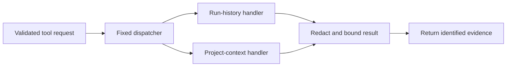

# Build stage 2: local storage and bounded tools

**Status:** Planned

**Related plans:** [AI agent implementation](ai-agent-build-plan.md), [architecture](architecture.md)

## Goal

Persist every completed command as a redacted run record in local SQLite, and create investigations for failures. Then implement bounded, read-only handlers for `getRecentLogs`, `searchLogs`, and `getProjectContext`. The model continues to request tools through the existing schemas. The application validates each request, runs the corresponding local handler, redacts and bounds its result, and returns identified evidence for the next agent call.

This stage provides the storage and retrieval services used by [build stage 3](build-stage-3-investigation-loop.md). It does not add an autonomous tool loop or any file or command mutation.

## Existing contracts

- Tool request inputs are defined in [schemas.ts](../src/agents/schemas.ts): recent/search logs accept limits of 1–20, project context accepts 1–5 files, and search queries are limited to 256 characters.
- `runAgent` returns validated tool requests. The AI SDK tools in [tools.ts](../src/agents/tools.ts) have no `execute` handlers.
- Every attached result must use the existing `RunAgentEvidence` shape: a unique ID, source type, excerpt, and a project-relative path for project files.
- Current evidence sources are `run_log`, `historical_log`, and `project_file`. Add `tool_result` as a source type for bounded outcomes such as “no matches”, “file skipped”, or “result truncated”. This lets the model see that a lookup completed even when it produced no content evidence.

## Request-to-evidence flow

## Implementation plan

### 1. Add the local SQLite boundary

Create the storage modules proposed in the [architecture](architecture.md):

- `src/storage/database.ts` opens the user-controlled local database and enables foreign keys.
- `src/storage/schema.ts` owns versioned migrations and indexes.
- `src/storage/repositories/` provides typed access to runs, log events, investigations, and evidence.

Create or migrate these records:

| Table | Required data |
| --- | --- |
| `runs` | ID, project association, related investigation, redacted command display, local working directory, start/end time, nullable exit code, status, stream byte counts |
| `log_events` | ID, run ID, stream, sequence, redacted content |
| `investigations` | ID, trigger run, status, diagnosis, model and prompt version, timestamps |
| `investigation_evidence` | Evidence ID, investigation ID, source type and source ID, redacted excerpt, content hash |
| `investigation_tool_calls` | ID, investigation ID, round, tool name, request hash, outcome status, safe summary, timestamps |
| `fix_proposals` | ID, investigation ID, exact proposed file changes, content hash, approval status, decision timestamps |
| `command_proposals` | ID, investigation ID, exact suggested command and reason, payload hash, approval status, linked execution run |

Write a run and its log events in one transaction. Write each investigation transition and its evidence consistently, and add uniqueness constraints for `(investigation_id, evidence_id)` and `(investigation_id, request_hash)` so retries cannot duplicate citations or execute a previously completed lookup again. Store request hashes and safe summaries rather than raw model-supplied queries. Index run time, run ID, investigation ID, and searchable log content.

Keep absolute paths and project association in local storage only. The tool and context APIs should return relative project paths and redacted evidence. Apply the product defaults: 14-day history retention and a configurable 2 MB combined stdout/stderr limit per run. Retention cleanup should delete related log events and evidence through foreign-key cascades. Provide a history-clear operation with explicit user confirmation so users can remove local history on demand.

### 2. Implement the tool dispatcher

Add a fixed dispatcher under `src/investigation/` that accepts `unknown`, parses it with `ToolRequestSchema`, and maps the three allowed names to explicit handlers. The dispatcher must not dynamically import or execute a model-supplied name. Each handler independently parses its input schema and enforces its limits.

Use an internal result contract with:

- A completion status: `ok`, `empty`, `limited`, or `unavailable`.
- Zero or more `RunAgentEvidence` records.
- A short, safe summary for the `tool_result` evidence.

Redact the summary and evidence before persistence or model handoff. Do not include raw exceptions, absolute paths, or file contents in operational logs.

### 3. Implement run-history handlers

**`getRecentLogs`**

- Query the requested run and its redacted events in sequence order.
- Respect the validated `limit` and the per-call output budget.
- Return `run_log` evidence for the active run and `historical_log` evidence for other runs.
- Return a `tool_result` evidence item when the run is missing or has no additional matching excerpts.

**`searchLogs`**

- Search redacted local log events within the active project, optionally narrowed to `runId`.
- Use parameterized SQL and escape `%` and `_` so a query is treated as text.
- Use case-insensitive matching, stable ordering, and the validated result limit.
- Return only excerpts around matches; never return whole log rows when a small excerpt is sufficient.
- Attach a `tool_result` evidence item for an empty result, truncation, or unavailable history.

Both handlers are read-only. They never call the model or mutate project files.

### 4. Implement project-context retrieval

`getProjectContext` receives a query and a maximum file count, not a filesystem path. The application chooses candidate files under the active project root using deterministic ranking based on query terms, filenames, and relevant configuration/source files.

Enforce the root boundary independently of the model:

- Resolve candidates and the project root with `realpath`; reject symlinks that leave the root.
- Reuse `isSafeProjectRelativePath` and the architecture exclusions for `.env` files, credentials, `.git`, dependencies, generated output, and lockfiles.
- Skip binary and oversized files. Start with a 64 KiB per-file read cap and a 256 KiB aggregate read cap per request; keep both values configurable.
- Bound candidate discovery as well as file contents: use targeted candidates from the query and a capped project-file walk, with no repository-wide index.
- Redact file contents before excerpt selection. Return project-relative paths only.
- Limit the result to the requested file count, 4,000 characters per evidence excerpt, and the shared tool-result character budget.

Add a `project_file` evidence item for each returned file and a `tool_result` item if files were skipped, no useful files were found, or the result was shortened. A model query is a search hint; it is never authority to read an arbitrary path.

### 5. Build stable evidence

Every result excerpt must be reproducible and traceable to its source:

- Use `run_log`, `historical_log`, or `project_file` for retrieved content.
- Use `tool_result` for empty, limited, or unavailable outcomes.
- Generate IDs from bounded stable identifiers, such as the run/event ID, a hash of the relative path and content, or investigation ID plus lookup round.
- Keep IDs unique within an investigation and within the schema's 80-character limit.
- Set `relativePath` only for `project_file`; validate the finished records with `RunAgentEvidenceSchema`.
- Persist the same evidence IDs that will be passed to `runAgent`, so returned diagnosis citations can be shown and audited.

Use one shared result-size helper. Initial defaults should cap each handler response at 8,000 excerpt characters and five content evidence records plus at most one short `tool_result` record, while each excerpt remains at or below the schema's 4,000-character limit. Stage 3 applies the stricter cumulative investigation budget across repeated calls.

## Files and components

- `src/storage/database.ts`
- `src/storage/schema.ts`
- `src/storage/repositories/runs.ts`
- `src/storage/repositories/log-events.ts`
- `src/storage/repositories/investigations.ts`
- `src/storage/repositories/evidence.ts`
- `src/storage/repositories/tool-calls.ts`
- `src/storage/repositories/fix-proposals.ts`
- `src/storage/repositories/command-proposals.ts`
- A repository operation and CLI entry point for clearing local history
- `src/investigation/tool-dispatcher.ts`
- `src/investigation/tool-handlers/get-recent-logs.ts`
- `src/investigation/tool-handlers/search-logs.ts`
- `src/investigation/tool-handlers/get-project-context.ts`
- Extend `RunAgentEvidenceSchema` for `tool_result`

## Completion checks

- A restart preserves redacted runs, investigations, and evidence; retention removes expired history and related events.
- Invalid tool inputs cause no database or filesystem access.
- Each tool observes its input count, file, byte, and output-character caps even when called directly.
- Log queries are scoped to the active project and return redacted excerpts with stable IDs.
- Project retrieval skips excluded paths and symlinks that resolve outside the root.
- Empty, limited, and unavailable results reach the agent as identified `tool_result` evidence.
- No handler writes project files, executes commands, calls Laminar, or invokes the model.

Keep all fixtures synthetic. Runtime storage and retrieval remain local; Laminar continues to receive only opt-in synthetic evaluation runs.
