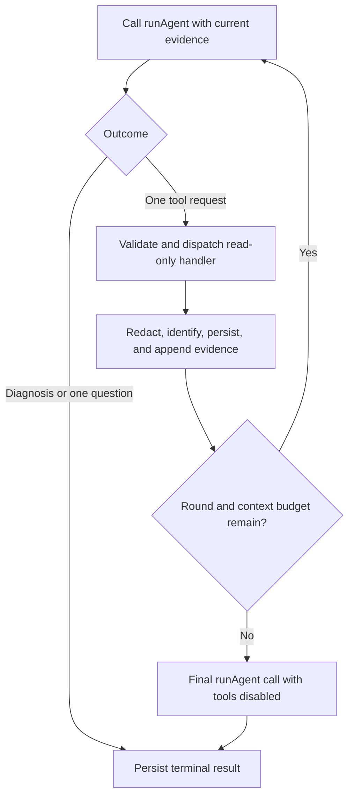

# Build stage 3: bounded investigation loop

**Status:** Planned

**Prerequisite:** [Build stage 2: local storage and bounded tools](build-stage-2-storage-and-tools.md)

## Goal

Turn the current one-call agent contract into a bounded application loop. For each failed run, call `runAgent`, execute each validated read-only tool request through the stage 2 dispatcher, attach the redacted result as identified evidence, then call `runAgent` again. Stop when the agent returns a diagnosis, including at most one focused question.

The model continues to propose tool requests. The application owns tool execution, budgets, persistence, and stopping conditions.

## Current behavior to preserve

- `runAgent` in [run-agent.ts](../src/agents/run-agent.ts) validates one `RunAgentInput` and returns either a diagnosis or tool requests.
- The tools in [tools.ts](../src/agents/tools.ts) have no execution callbacks. A request is not evidence that a lookup ran.
- The system prompt asks for one useful lookup at a time and says tool requests return no diagnosis.
- `RunAgentInputSchema` validates evidence IDs and caps the combined command, output, and evidence at 48,000 characters.
- `validateDiagnosisForInput` rejects references to missing evidence IDs and disallows a proposed fix when `missingInformation` is present.

## Investigation flow

1. Create or resume a persisted investigation for the failed run with status `investigating`.
2. Build the initial, redacted `RunAgentInput` and validate it.
3. Call `runAgent(input)`.
4. If the result is a diagnosis, persist it with its model and prompt version and finish the loop.
5. If the result is one tool request, parse it again at the application boundary and dispatch it to the stage 2 handler.
6. Redact and bound the handler result. Give each excerpt a stable evidence ID, persist it under the investigation, append it to the input, and validate the new input.
7. Call `runAgent` again with the same failed-run fields and all retained evidence IDs and excerpts.
8. Stop on a diagnosis, one `missingInformation` question, an exhausted lookup/context budget, cancellation, or a handled application/model error.

Treat a diagnosis with one `missingInformation` entry as the focused-question outcome. Persist it with `needs_input` status and display the question for the user. Do not ask a second question during this investigation. `validateDiagnosisForInput` already ensures this result cannot include a proposed patch.

## Loop limits and context budget

Make the loop bounded independently of model behavior:

- Allow at most three tool-request rounds per investigation.
- Allow exactly one tool request per model response. Tighten `RunAgentResultSchema` to one request and keep the prompt rule aligned. An invalid multi-request response causes no tool execution.
- Reserve up to 16,000 characters of the 48,000-character `RunAgentInput` budget for tool evidence. Cap the initial context at 32,000 characters so later evidence has space.
- Cap one handler response at the stage 2 limit of 8,000 excerpt characters and cap cumulative tool evidence at 16,000 characters per investigation.
- Keep each evidence excerpt at or below 4,000 characters and the final evidence array at or below 30 entries.
- Cap tool evidence at 18 entries across three rounds (up to five content excerpts plus one outcome excerpt per round). Together with the initial capture's two log excerpts, this stays below the schema's 30-entry limit.
- Stop adding evidence before any cap would be exceeded. Preserve the highest-ranked results and attach a short `tool_result` evidence item explaining that the result was limited.

Use a shared budget helper that counts exactly the fields counted by `RunAgentInputSchema`: command display, stdout, stderr, and evidence excerpts. Re-run `RunAgentInputSchema.parse()` after every evidence append. Do not rely on a token estimate as a substitute for character validation.

When the lookup-round or evidence budget is exhausted, make one final `runAgent` call with tools disabled and a prompt to answer from current evidence or return one focused question. Add an `allowTools` option or a distinct final-call entry point in the agent layer. If that response is invalid or unavailable, end with a clear persisted investigation error rather than starting another loop.

## Request handling and evidence

For every response:

1. Validate the `RunAgentResult` and its request with the existing schemas before any local access.
2. Canonicalize the request by tool name and parsed input, then persist its request hash as pending. Keep a set of completed request hashes for the investigation. A duplicate completed request causes no second lookup; move to the final no-tools call.
3. Dispatch through the fixed stage 2 registry. Keep the handler read-only and within its limits. If the process restarts with a pending request, safely retry that same request and update its existing ledger row.
4. Store the tool result, outcome status, and evidence IDs together before making the next model call. Use stable IDs so retries do not create duplicate evidence.
5. Attach source evidence as `run_log`, `historical_log`, or `project_file`. Attach `tool_result` evidence for an empty, limited, or unavailable result so the agent knows what happened.
6. Send the entire bounded evidence set to the next call, not only the most recent excerpt. Diagnosis citations must resolve against the exact evidence set for that call.

Tool text and file contents are untrusted input. The model's request is a search hint; application handlers enforce project, path, file, byte, result-count, and output-size restrictions.

## Persistence and state

Persist each state transition so `wtf history` can show what happened:

| Event | Investigation status |
| --- | --- |
| Loop starts or continues retrieving evidence | `investigating` |
| Diagnosis includes one missing-information question | `needs_input` |
| Diagnosis contains a proposed fix | `awaiting_patch_approval` |
| Diagnosis is complete without a fix or question | `diagnosed` |
| Model, storage, or handler failure prevents a valid outcome | `failed` |

Add `diagnosed`, `failed`, `needs_input`, and `awaiting_patch_approval` to the stored status model if needed; a diagnosis without a patch has not been verified and must not be marked `resolved`. Persist the tool-round count and last safe error code. Keep raw prompts, raw outputs, and absolute project paths out of tool-result evidence.

Commit each tool result's evidence, request-ledger outcome, and round-state update together. On restart, stable IDs and the request ledger must prevent duplicate evidence or repeated completed lookups; stage 2 handlers are read-only, so an interrupted lookup may be safely repeated.

## Implementation components

- `src/investigation/run-investigation.ts` coordinates initial input, tool requests, evidence append, and terminal outcomes.
- `src/investigation/tool-dispatcher.ts` uses the stage 2 fixed handler registry.
- `src/context/append-tool-evidence.ts` enforces the shared character, excerpt, and item-count budgets.
- `src/agents/run-agent.ts` supports calls with tools enabled and a final call with tools disabled.
- `src/agents/schemas.ts` limits each result to one tool request and includes the stage 2 `tool_result` evidence source.
- Storage repositories persist the request round, result evidence, status, diagnosis, and prompt/model metadata.

## Evaluation and completion checks

Add synthetic cases to the existing Laminar dataset for:

- One lookup followed by an evidence-grounded diagnosis.
- Two sequential, distinct lookups followed by a diagnosis.
- Empty and limited tool results followed by a focused question.
- A repeated request, multi-request response, exhausted round budget, and exhausted character budget.
- A tool result containing prompt-injection text or a secret-shaped value.
- A diagnosis citing an ID from the latest tool result and one citing an unknown ID.

The stage is complete when successful runs never enter the loop; failed runs persist their investigation; only validated, bounded read-only requests execute; each re-call receives the identified redacted evidence; the loop stops within the declared limits; and its final diagnosis or one question is ready for the review UI in [build stage 4](build-stage-4-diagnosis-review-and-approvals.md).

Keep evaluation datapoints synthetic. Laminar upload and evaluation remain opt-in and separate from runtime tool execution.
