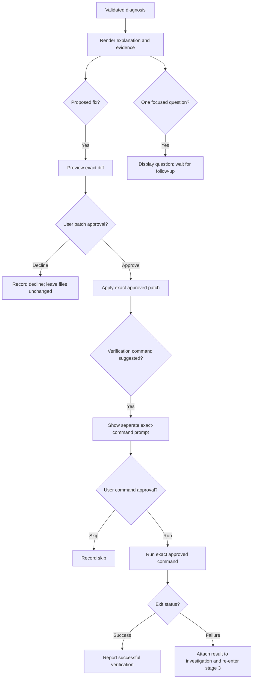

# Build stage 4: diagnosis review and separate approvals

**Status:** Planned

**Prerequisite:** [Build stage 3: bounded investigation loop](build-stage-3-investigation-loop.md)

## Goal

Render a validated diagnosis, its evidence, and any proposed multi-file diff so the user can review them. Keep patch approval and command approval as separate actions with separate application services. The model can propose a change or command; only an explicit user action may start either operation.

## Current UI to replace or adapt

The current Ink view in [InvestigationView.tsx](../src/ui/views/InvestigationView.tsx) seeds hard-coded sample data and simulates verification with a timer. Its `FixPatch` UI type supports one file, while `DiagnosisSchema` supports up to three. The view's patch-approved state also displays “Patch applied” before any application service reports success.

Use this stage to connect the existing components to the persisted investigation and agent schemas. Remove demo defaults and simulated outcomes from the production path.

## View model and rendering

Create a UI adapter from the validated `Diagnosis`, its associated `RunAgentInput`, persisted evidence, and application state. Keep agent schemas as the source of truth; UI types should represent presentation state rather than a second diagnosis contract.

Render the investigation in this order:

1. **Failed command:** display the redacted command and exit status.
2. **What the evidence shows:** display observations and their evidence IDs, with a way to inspect the exact redacted excerpts.
3. **Likely cause:** show the cause, rationale, and confidence when present. Keep observations visually distinct from model inference.
4. **Explanation:** display the beginner-friendly explanation steps.
5. **Missing information:** when `missingInformation` contains its single question, show that question and a single answer control. Do not show patch-approval controls for this outcome.
6. **Proposed fix:** when `proposedFix` exists, show its summary, cited evidence, and every file diff.
7. **Verification suggestion:** show the exact command and reason as a separate proposed action. A suggestion is not a run result.

Display only safe, redacted content and project-relative file paths. Keep absolute working-directory metadata out of the model-facing and default review view. Sanitize terminal control sequences before rendering model or log text.

### Multi-file diff review

Update `DiffViewer` to accept the schema's `proposedFix.files` array. Give each file its own relative-path heading and diff block; keep additions, removals, and hunk headers visually distinct. Support scrolling or paging for large proposals, and keep the displayed diff identical to the proposal submitted for approval.

Before the review view enables approval, validate the diagnosis against the exact input evidence, validate every path with `isSafeProjectRelativePath`, scan proposed content for secret-shaped values, and reject a fix paired with a missing-information question. If redaction would change a proposed executable command or patch, reject it for review instead of storing or approving a payload that contains the secret. Invalid proposals show a safe error state with no approval action.

## Patch approval

Make the patch review state explicit:

| State | User-visible behavior |
| --- | --- |
| `awaiting_patch_approval` | Show the exact diff with separate Apply and Decline actions |
| `applying_patch` | Show progress and disable duplicate actions |
| `patch_applied` | Report success only after the patch service confirms it |
| `patch_declined` | Record the decision and make no file changes |
| `stale_patch` | Refresh the diff and request approval for the refreshed version |
| `patch_failed` | Show a safe failure result and preserve the proposed diff for review |

The UI sends a proposal ID or content hash to `src/approvals/apply-approved-patch.ts`; it does not write files itself. The service reloads the `fix_proposals` record, checks that the approved paths remain inside the project and that target contents match the preview, then applies only that exact diff. Persist the decision against that proposal. If a target changed, generate a new preview and ask again.

Patch approval applies the patch only. It never launches a verification or repair command.

## Separate command approval

After a patch is applied, or when a repair requires a package-manager command, render a distinct command-approval card:

- Show the exact command and why it is suggested.
- Offer explicit Run and Skip actions.
- Bind the approval to the exact command text and proposal version.
- Invoke `src/approvals/run-approved-command.ts` only after the user chooses Run.
- Display the command's captured stdout, stderr, and exit status after execution.

Command states:

| State | User-visible behavior |
| --- | --- |
| `awaiting_command_approval` | Show the exact suggested command with separate Run and Skip actions |
| `running_command` | Show progress and disable duplicate command starts |
| `verification_success` | Report the successful exit status and captured output |
| `verification_failure` | Show captured output and return the run to the stage 3 investigation flow |

The command service must reload the `command_proposals` record and verify its approved payload hash before launching it. A changed command requires another approval. Persist its decision independently from the patch decision. Persist the captured run and show its actual exit status. A successful verification is reported to the user; a failed verification is attached as identified evidence and returned to the stage 3 flow for an updated diagnosis.

## Question and diagnosis outcomes

- A diagnosis with one missing-information question transitions to `needs_input` and renders the question control. There is no patch to approve in this state.
- A diagnosis with a proposed fix transitions to `awaiting_patch_approval`.
- A useful diagnosis with neither a patch nor a question transitions to `diagnosed`; do not label it resolved without verification.
- A malformed diagnosis, unknown evidence ID, or unsafe path transitions to a non-actionable error state.
- After the question is displayed, any user response belongs to a separately bounded follow-up flow; it does not trigger patch or command actions.

## Review and approval paths

## Components and state

Adapt the current UI files:

- `src/ui/types/index.ts` — derive/represent the validated diagnosis view model and add applying, command-approval, needs-input, and failure states.
- `src/ui/views/InvestigationView.tsx` — render live investigation data and connect application callbacks; remove hard-coded sample diagnosis and fake verification timer.
- `src/ui/components/ErrorEvidence.tsx` — display redacted command details and evidence excerpts.
- `src/ui/components/Explanation.tsx` — present observations, likely cause, confidence, and beginner explanation from `Diagnosis`.
- `src/ui/components/DiffViewer.tsx` — render all proposed files.
- `src/ui/components/ApprovalPrompt.tsx` — split patch actions from command actions, or replace it with distinct approval components.
- `src/ui/components/QuestionModal.tsx` — render the single `missingInformation` question returned by the investigation loop.
- `src/approvals/apply-approved-patch.ts` and `src/approvals/run-approved-command.ts` — own mutations and enforce their separate gates.

The view calls services through callbacks and renders their returned states. It does not claim that a patch was applied or a command passed before receiving the corresponding service result.

## Completion checks

- Diagnosis observations, cause, confidence, explanation, question, and proposed fix render from persisted validated data.
- Every displayed evidence citation opens the matching redacted excerpt.
- Multi-file proposals display all files and preserve their relative paths and exact diff content.
- A question-only diagnosis shows no patch approval action.
- Patch approval applies only the reviewed proposal; declining changes no files.
- A stale target refreshes the preview and requires a new patch approval.
- Applying a patch never runs a command.
- A verification or repair command runs only after its separate exact-command approval.
- Progress and completion labels reflect application-service results rather than UI state changes alone.
- A verification run's output and status are attached to the investigation and can re-enter stage 3.

Keep interaction fixtures and UI checks synthetic. Patch and command approval paths should also be reviewed against the product brief's requirement for explicit, separate user approval.
